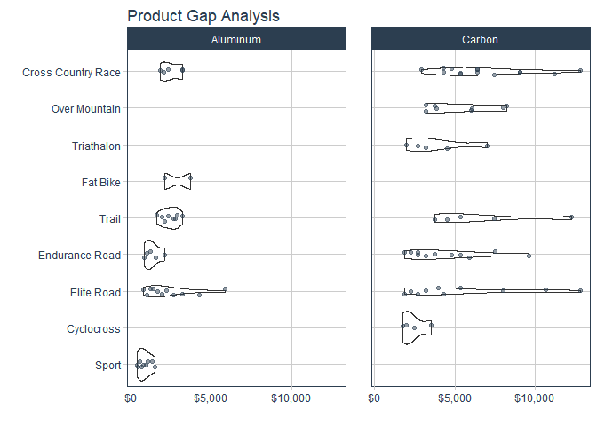

Product Pricing Algorithm
================
Created by James Rohloff

## Problem Statement

The Research and Development department seeks assistance in determining
new product ideas and pricing by leveraging the existing product line as
a benchmark.

## Solution Summary

We have identified several product gaps in the existing product line,
including:

1.  Aluminum Over Mountain

2.  Aluminum Triathalon

The Data Science Team has developed a pricing model that utilizes
predictive analytics to estimate the price of new bicycle models based
on the existing fleet. This ensures that new models are competitively
priced relative to similar bicycles in the market.

New product predictions for 2 models:

1.  Trigger, Over Mountain with Aluminum Frame: \$2,903

2.  Slice, Triathalon with Aluminum Frame: \$2,273

**Next Steps**: Integrate the model into a proof-of-concept web
application for deployment to the R&D department.

## Gap Analysis

### Bike List

Our current product portfolio consists of 97 bike models that were
analyzed.

    ## # A tibble: 97 × 15
    ##       id price model  category_1 category_2 frame_material model_base model_tier
    ##    <int> <dbl> <chr>  <chr>      <chr>      <chr>          <chr>      <chr>     
    ##  1     1  6070 Jekyl… Mountain   Over Moun… Carbon         Jekyll     Carbon 2  
    ##  2     2  5970 Trigg… Mountain   Over Moun… Carbon         Trigger    Carbon 2  
    ##  3     3  2770 Beast… Mountain   Trail      Aluminum       Beast of … 1         
    ##  4     4 10660 Super… Road       Elite Road Carbon         Supersix … Hi-Mod Te…
    ##  5     5  3200 Jekyl… Mountain   Over Moun… Carbon         Jekyll     Carbon 4  
    ##  6     6 12790 Super… Road       Elite Road Carbon         Supersix … Black Inc.
    ##  7     7  5330 Super… Road       Elite Road Carbon         Supersix … Hi-Mod Du…
    ##  8     8  1570 Synap… Road       Endurance… Aluminum       Synapse    Disc 105  
    ##  9     9  4800 Synap… Road       Endurance… Carbon         Synapse    Carbon Di…
    ## 10    10   480 Catal… Mountain   Sport      Aluminum       Catalyst   3         
    ## # ℹ 87 more rows
    ## # ℹ 7 more variables: black <dbl>, hi_mod <dbl>, team <dbl>, red <dbl>,
    ## #   ultegra <dbl>, dura_ace <dbl>, disc <dbl>

### Gaps

The visualization segments the full bicycle product line by category and
frame material, exposing two product gaps:

1.  A new **Aluminum** line of bikes in the **Over Mountain** Category

2.  A new **Aluminum** line of bikes in the **Triathalon** Category

## Price Prediction

New product predictions for 2 models:

1.  Trigger, Over Mountain with Aluminum Frame: \$2,903

2.  Slice, Triathalon with Aluminum Frame: \$2,273

| New Model Attribute | Trigger Al 1  | Slice Al 1 |
|:--------------------|:--------------|:-----------|
| .pred               | \$2,903       | \$2,273    |
| frame_material      | Aluminum      | Aluminum   |
| category_2          | Over Mountain | Triathalon |
| model_base          | Trigger       | Slice      |
| model_tier          | Aluminum 1    | Ultegra    |
| black               | 0             | 0          |
| hi_mod              | 0             | 0          |
| team                | 0             | 0          |
| red                 | 0             | 0          |
| ultegra             | 0             | 0          |
| dura_ace            | 0             | 0          |
| disc                | 0             | 0          |
